# LaRP: Lookahead Rollout Planning for CVRP

Extension of **Multi-node Lookahead Prediction (MnLP)** [IJCAI'26] with **inference-time rollout planning** using a learned **value world model (WM)** on CVRP.

The released MnLP policy (`checkpoints/cvrp_mnlp.pt`) is the **baseline decoder**. At test time it runs greedy autoregressive decoding (no MTP overhead). This repo adds a WM that scores partial routes and optionally overrides greedy among top-K policy candidates.

## Architecture

```mermaid
flowchart TB
    subgraph baseline["Baseline (MnLP greedy)"]
        P[CVRP instance] --> Enc[Transformer encoder-decoder]
        Enc --> Greedy[argmax action per step]
        Greedy --> Tour[Complete CVRP tour]
    end

    subgraph wm_train["World model training"]
        Prefix[Partial route prefix] --> WM[CVRPWorldModel]
        WM --> Vhat["Predict remaining cost"]
        Target["LKH or policy completion cost"] --> Loss["Huber + ranking loss"]
        Vhat --> Loss
    end

    subgraph rollout["Rollout planner (inference)"]
        State[Current partial state] --> Policy[MnLP top-K + greedy]
        Policy --> Cand[Candidate actions]
        Cand --> Score["1-step edge cost + WM(state')"]
        Score --> Gate{"score < greedy - margin?"}
        Gate -->|yes| Pick[Override action]
        Gate -->|no| Keep[Keep greedy]
    end
```



### 1. Baseline policy (MnLP)

| Component | Detail |
|-----------|--------|
| Model | LEHD-style transformer encoder–decoder (`CVRP/VRPModel.py`) |
| Training | Multi-token prediction (MTP) auxiliary loss at train time |
| Inference | Greedy decoding, one customer/depot step at a time |
| Checkpoint | `checkpoints/cvrp_mnlp.pt` |

### 2. Value world model

| Component | Detail |
|-----------|--------|
| Class | `CVRPWorldModel` (`CVRP/world_model.py`) |
| Encoder | 2-layer transformer, 256-dim, 4 heads |
| Node features (6) | x, y, demand, visited, per-node capacity, dist-to-current |
| Context (6) | current xy, remaining capacity, progress, prefix cost, unvisited fraction |
| Output | Normalized remaining tour cost → `clamp(pred,0) × cost_scale` |
| Simulator | Exact CVRP transitions (`CVRP/simulator.py`) |

### 3. Rollout planner

| Component | Detail |
|-----------|--------|
| Class | `RolloutWMPlanner` (`CVRP/rollout_planner.py`) |
| Per step | MnLP top-K feasible actions + greedy baseline |
| Score | `edge_cost(first_action) + WM.predict_remaining(state_after_action)` |
| Selection | Switch from greedy only if `score < greedy_score - margin` (**margin gate**) |

### 4. WM training modes

`CVRP/train_world_model.py` supports:

| Mode | Prefix source | Loss |
|------|---------------|------|
| `lkh` | Random prefixes along LKH optimal tours | Smooth L1 on remaining cost |
| `policy` | Random prefixes along greedy MnLP tours | Smooth L1 + pairwise ranking hinge |
| `mixed` | 50/50 LKH and policy prefixes | Same as above |

Ranking pairs compare greedy vs one alternate top-K action at the same policy state, with targets from completing the tour greedily.

## Repository layout

```text
CVRP/                     Model, env, WM, rollout planner, training
  world_model.py          Value world model
  simulator.py            Exact partial-route simulator
  rollout_planner.py      Top-K + WM scoring at inference
  train_world_model.py    WM training (LKH / policy / mixed)
  policy_rollout.py       Greedy trajectory collection for WM training
scripts/
  evaluate.py             Greedy and rollout_wm evaluation
  run_wm_eval.sh          Train policy WM + 4-episode comparison
  train_wm_nohup.sh       Detached WM training
checkpoints/
  cvrp_mnlp.pt            Paper MnLP CVRP checkpoint (baseline)
```

WM checkpoints (`cvrp_world_model.pt`, `cvrp_world_model_policy.pt`) are local training outputs and are gitignored.

## Setup

```bash
pip install -r requirements.txt
conda activate mnlp   # Python 3.8, PyTorch 2.x (needs nn.RMSNorm)
```

CPU works for smoke tests (`--device cpu`). Full 128-instance evals are faster on GPU.

## Data

Benchmark files are not committed. Place under:

```text
CVRP/data/vrp100_test_lkh.txt
CVRP/data/vrp200_test_lkh.txt
CVRP/data/vrp500_test_lkh.txt
CVRP/data/vrp1000_test_lkh.txt
```

Download from [LEHD](https://github.com/CIAM-Group/NCO_code/tree/main/single_objective/LEHD).

## Experiments and reported gaps

Gap = `(student_cost - LKH_optimal) / LKH_optimal × 100%`. Lower is better.

### Baseline — MnLP greedy (reproduced)

| Dataset | Episodes | Gap | Notes |
|---------|----------|-----|-------|
| **CVRP200** | 128 | **3.206%** | Matches paper; `RRC=0`, CPU |
| CVRP100 | — | — | Supported; not re-run in this extension |
| CVRP500 | — | — | Supported; not re-run in this extension |
| CVRP1000 | — | — | Supported; not re-run in this extension |

```bash
python scripts/evaluate.py --size 200 --checkpoint checkpoints/cvrp_mnlp.pt \
  --rrc 0 --device cpu
```

### Extension — rollout + world model (CVRP200)

**Paper baseline (MnLP greedy, 128 episodes): 3.206% gap.** That is the number to beat.

The table below is a **4-episode dev subset** (episodes 0–3) used for fast rollout iteration. On this subset greedy MnLP scores **1.435%** — easier instances than the full 128-episode average, so dev gaps are **not** comparable to 3.206%. Rollout rows are compared to greedy **on the same 4 instances**.

| Method | WM checkpoint | Margin | Gap (4-ep dev) | vs greedy (same 4 ep) |
|--------|---------------|--------|----------------|------------------------|
| Greedy MnLP | — | — | 1.435% | reference on dev set |
| Rollout + WM | LKH prefixes (`cvrp_world_model.pt`) | 0 | 17.851% | much worse — WM overrides with wrong actions |
| Rollout + WM | LKH prefixes | 1.0 | 1.435% | matches greedy on dev set |
| Rollout + WM | Policy prefixes (`cvrp_world_model_policy.pt`) | 1.0 | 2.468% | worse on dev set |
| Rollout + WM | Policy prefixes | 10.0 | 1.435% | matches greedy on dev set |
| Rollout + WM | Fine-tuned mixed (`cvrp_world_model_policy_ft.pt`) | 1.0 | 7.101% | worse than pre-FT and greedy |
| Rollout + WM | Fine-tuned mixed | 10.0 | 1.435% | matches greedy on dev set |

**Success criterion for full eval:** rollout gap ≤ **3.206%** on 128 episodes (MnLP baseline), after rollout ≤ greedy on the 4-ep dev set.

**WM training (LKH prefixes):** best val MAE **0.44** at epoch 3 (`cost_scale ≈ 20.05`).

**WM training (policy prefixes + ranking):** best val MAE **1.18** (`cvrp_world_model_policy.pt`).

**Fine-tuning (mixed prefixes, init from policy WM):** 20 epochs; best val MAE **0.91** at epoch 14 → `checkpoints/cvrp_world_model_policy_ft.pt`. Rollout on 4-ep dev at margin=1.0: **7.10%** (worse than pre-FT); margin=10.0 matches greedy. Val MAE improved but action ranking at inference did not.

**Takeaway:** Low val MAE on LKH states does not imply good action ranking on greedy policy states. The margin gate prevents catastrophic regression; the goal is to beat **3.206%** on 128 instances, not just match greedy on the 4-ep dev slice.

## Commands

**Greedy baseline (smoke, 4 episodes):**

```bash
python scripts/evaluate.py --size 200 --checkpoint checkpoints/cvrp_mnlp.pt \
  --rrc 0 --device cpu --episodes 4 --batch-size 1
```

**Fine-tune WM (mixed prefixes, from policy checkpoint):**

```bash
bash scripts/train_wm_finetune.sh
# monitor: tail -f logs/wm_finetune_*.log
```

**Train WM on policy prefixes (from scratch):**

```bash
python CVRP/train_world_model.py --device cpu --epochs 15 --steps-per-epoch 256 \
  --batch-size 16 --episodes 128 --trajectory-source policy \
  --policy-checkpoint checkpoints/cvrp_mnlp.pt \
  --ranking-weight 0.5 --output checkpoints/cvrp_world_model_policy.pt
```

**Rollout eval with margin gate:**

```bash
python scripts/evaluate.py --size 200 --planner rollout_wm \
  --wm-checkpoint checkpoints/cvrp_world_model_policy.pt \
  --wm-top-k 3 --wm-margin 1.0 --rrc 0 --device cpu --episodes 4 --batch-size 1
```

## Reference

MnLP base method — please cite:

```bibtex
@inproceedings{jiang2026learning,
  title={Learning with Foresight: Enhancing Neural Routing Policy via Multi-Node Lookahead Prediction},
  author={Xia Jiang and Yaoxin Wu and Yew-Soon Ong and Yingqian Zhang},
  booktitle={International Joint Conference on Artificial Intelligence (IJCAI)},
  year={2026}
}
```
